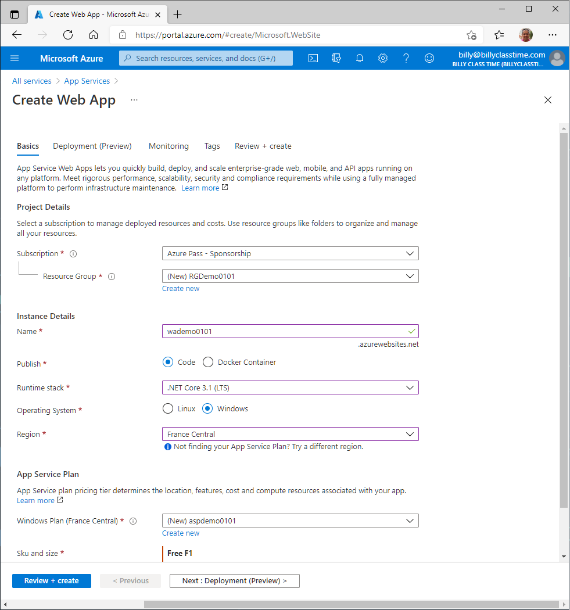

### Demo: Create a Web App by using the Azure Portal

In this demo you will learn how to create a Web App by using the Azure Portal.

#### Create a web app

1. Sign in to the [Azure portal](http://portal.azure.com/).

2. Select the **Create a resource** link at the top of the left-hand navigation.

3. Select **Web > Web App** to display the web app creation wizard.

4. Fill out the following fields in each of the sections on the wizard:

   - Project Details
     - **Subscription**: Select the Azure subscription you are using for this class.
     - **Resource Group**: Create a new resource group to make it easier to clean up the resources later.
   - Instance Details
     - **Name**: The name you choose must be unique among all Azure web apps. This name will be part of the app's URL: *appname*.azurewebsites.net.
     - **Publish**: Select **Code** for this demo.
     - **Runtime Stack**: Select **.NET Core 3.1 LTS**. Your choice here may affect whether you have a choice of operating system - for some runtime stacks, App Service supports only one operating system.
     - **Operating System**: Keep **Windows** selected here, it's the default when you selected **.NET Core 3.1 LTS** above.
     - **Region**: Keep the default selection.
   - App Service Plan
     - **Windows Service Plan**: Leave the default selection. By default, the wizard will create a new plan in the same region as the web app.
     - **SKU and size**: Select **F1**. To select the **F1** tier, select **Change size** to open the Spec Picker wizard. On the **Dev / Test** tab, select **F1** from the list, then select **Apply**.

5. Navigate to the **Monitoring** tab at the top of the page and toggle **Enable Application Insights** to **No**.

   

6. Select **Review and Create** to navigate to the review page, then select **Create** to create the app. The portal will display the deployment page, where you can view the status of your deployment.

7. Once the app is ready you can select the **Go to resource** button and the portal will display the web app overview page. To preview your new web app's default content, select its URL at the top right. The placeholder page that loads indicates that your web app is up and running and ready to receive deployment of your app's code.

   

#### Clean up resources

1. In the Azure Portal select **Resource groups**.
2. **Select** the name of the resource group you created above.
3. **Select** the **Delete resource group** button at the top of the Overview page.
4. You will be prompted to enter the resource group name to verify you want to delete it. Enter the name of the resource group and select **Delete**.

   