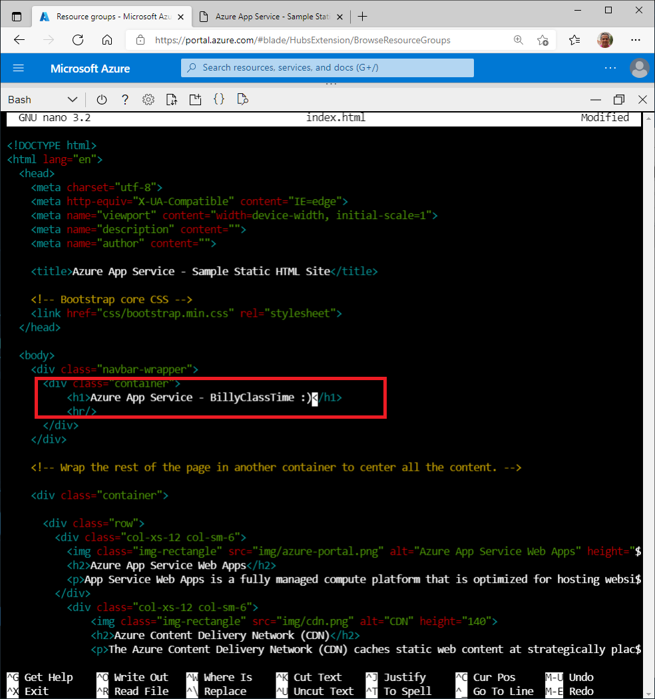

### Demo: Create a static HTML web app by using Azure Cloud Shell

In this demo you'll learn how to perform the following actions:

- Deploy a basic HTML+CSS site to Azure App Service by using the az webapp up command
- Update and redeploy the app

The az webapp up command does the following actions:

- Create a default resource group.
- Create a default app service plan.
- Create an app with the specified name.
- Zip deploy files from the current working directory to the web app.

#### Prerequisites

This demo is performed in the Cloud Shell using the Bash environment.

##### Login to Azure

1. Login to the [Azure portal](https://portal.azure.com/) and open open the cloud shell.
2. Be sure to select the **Bash** environment.

#### Download the sample

1. In the Cloud Shell, create a *demo* directory and then change to it.

   

   ```
   mkdir demoHTML
   
   cd $HOME/demoHTML
   ```

   

2. Run the following command to clone the sample app repository to your *demoHTML* directory.

   

   ```
   git clone https://github.com/Azure-Samples/html-docs-hello-world.git
   ```

   

#### Create the web app

1. Change to the directory that contains the sample code and run the az webapp up command. In the following example, replace <app_name> with a unique app name, and <region> with a region near you.

   

   ```
   cd html-docs-hello-world
   
   az webapp up --location <region> --name <app_name> --html
   ```

   

   This command may take a few minutes to run. While running, it displays information similar to the example below. Make a note of the resourceGroup value. You need it for the clean up resources section.

   

   ```
   {
   "app_url": "https://<app_name>.azurewebsites.net",
   "location": "westeurope",
   "name": "<app_name>",
   "os": "Windows",
   "resourcegroup": "<resource_group_name>",
   "serverfarm": "appsvc_asp_Windows_westeurope",
   "sku": "FREE",
   "src_path": "/home/<username>/demoHTML/html-docs-hello-world ",
   < JSON data removed for brevity. >
   }
   ```

   

2. Open a browser and navigate to the app URL (http://<app_name>.azurewebsites.net) and verify the app is running. Leave the browser open on the app for the next section.

   

#### Update and redeploy the app

1. In the Cloud Shell, type nano index.html to open the nano text editor. In the <h1> heading tag, change “Azure App Service - Sample Static HTML Site” to "Azure App Service".

2. Use the commands **^O** to save and **^X** to exit.

3. Redeploy the app with the same az webapp up command. Be sure to use the same *region* and *app_name* as you used earlier.

   

   ```
   az webapp up --location <region> --name <app_name> --html
   ```

   

4. Once deployment is completed switch back to the browser from step 2 in the “Create the web app” section above and refresh the page.


#### Clean up resources

1. After completing the demo you can delete the resources you created using the resource group name you noted in step 1 of the “Create the web app” section above.

   ```
   az group delete --name <resource_group> --no-wait --yes
   ```
   

