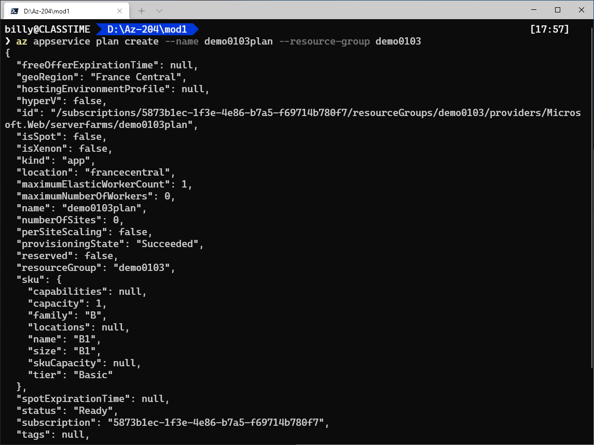
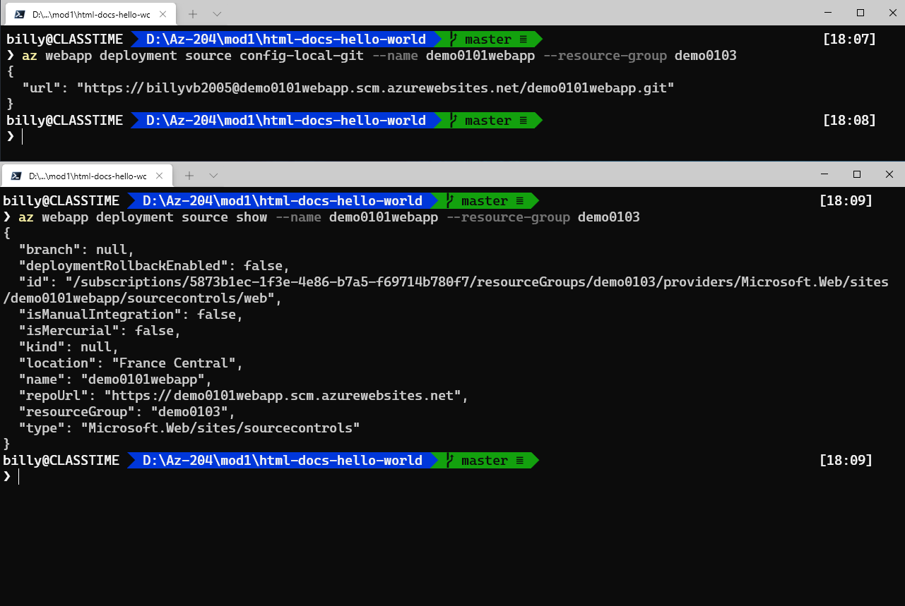

### Demo: Create a Web App with a local Git deployment source

This demo shows you how to deploy your app to Azure App Service from a local Git repository by using the Kudu build server and the Azure CLI.

#### Download sample code and launch Azure CLI

1. To download a sample repository, run the following command in your Git Bash window:

   

   ```
   git clone https://github.com/Azure-Samples/html-docs-hello-world.git
   ```

   

   Later in the demo you'll be entering more commands in the Git Bash window so be sure to leave it open.

   

2. Launch the Azure Cloud Shell and be sure to select the **Bash** environment.

   - You can either launch the Cloud Shell through the portal (https://portal.azure.com), or by launching the shell directly (https://shell.azure.com).

#### Create the web app

In the Cloud Shell run the following commands to create the web app and the necessary resources:

1. Create a resource group:

   ```
az group create --location <MyLocation> --name <MyResourceGroup>
   ```
   
   

2. Create an app service plan:

   ```
   az appservice plan create --name <MyPlan> --resource-group <MyResourceGroup>
   ```

   

3. Create the web app:

   ```
   az webapp create --name <MyUniqueApp> --resource-group <MyResourceGroup> --plan <MyPlan>  --deployment-local-git
   ```
   
   

#### Deploy with Kudu build server

We'll be configuring and using the Kudu build server for deployments in this demo. FTP and local Git can deploy to an Azure web app by using a deployment user. Once you configure your deployment user, you can use it for all your Azure deployments. Your account-level deployment username and password are different from your Azure subscription credentials.

The first two steps in this section are performed in the Cloud Shell, the third is performed in the local Git Bash window.

1. Configure a deployment user.

   If not provided a --password argument, you receive a prompt to input the password. (**Recommended**)

   ```
   az webapp deployment user set --user-name <username> --password <password>
   
   az webapp deployment user set --user-name <username>
   ```

   ```
   az webapp deployment user show
   ```

   - The username must be unique within Azure, and for local Git pushes, must not contain the ‘@’ symbol.
   - The password must be at least eight characters long, with two of the following three elements: letters, numbers, and symbols.
   - The JSON output shows the password as null. If you get a 'Conflict'. Details: 409 error, change the username. If you get a 'Bad Request'. Details: 400 error, use a stronger password.

   Record your username and password to use to deploy your web apps.

   

2. Get the web app deployment URL, the deployment URL is used in the Git Bash window to connect your local Git repository to the web app:

   ```
az webapp deployment source config-local-git --name <MyUniqueApp> --resource-group <MyResourceGroup>
   ```
   
   

   The command will return JSON similar to the example below, you'll use the URL in the Git Bash window in the next step.

   ```
{
   "url": "https://<deployment-user>@<MyUniqueApp>.scm.azurewebsites.net/<MyUniqueApp>.git"
   }
   ```
   
   ```
az webapp deployment source show --name <MyUniqueApp> --resource-group <MyResourceGroup>
   ```
   
   

3. Deploy the web app:

   **This step is performed in the local Git Bash window left open from earlier in the demo.**

   Use the cd command to change in to the directory where the html-docs-hello-world was cloned.

   Use the following command to connect the repository to the Web App:

   **NOTE:** you could make something change in index.html to review your changes in a cloud.
   
   ```
   git remote add azure <url>
   ```

   Use the following command to push the to the Azure remote:
   
   ```
   git push azure master
   ```
   
   

##### What happens to my app during deployment?

All the officially supported deployment methods make changes to the files in the /home/site/wwwroot folder of your app. These files are the same ones that are run in production. Therefore, the deployment can fail because of locked files. The app in production may also behave unpredictably during deployment, because not all the files updated at the same time. There are a few different ways to avoid these issues:

- Stop your app or enable offline mode for your app during deployment.
- Deploy to a staging slot with auto swap enabled.
- Use Run From Package instead of continuous deployment.

#### Verify results

In the Azure Portal navigate to the web app you created above:

1. In the **Overview** section select the **URL** to verify the app was deployed successfully.
2. Select **Deployment Center** to view deployment information.


From here you can make change to the code in the local repository and push the change to the web app.

#### Clean up resources

In the Cloud Shell use the following command to delete the resource group and the resources it contains. The --no-wait portion of the command will return you to the Bash prompt quickly without showing you the results of the command. You can confirm the resource group was deleted in the Azure Portal

```
az group delete --name <MyResourceGroup> --no-wait --yes
```

